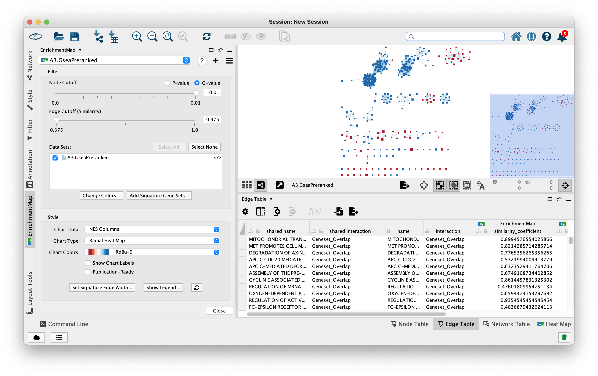
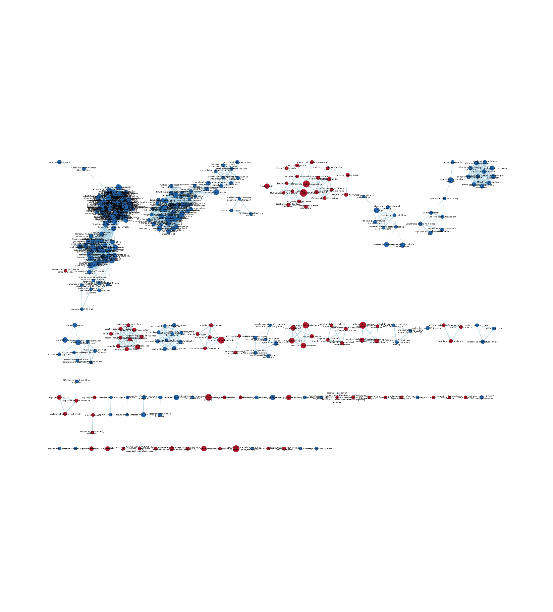
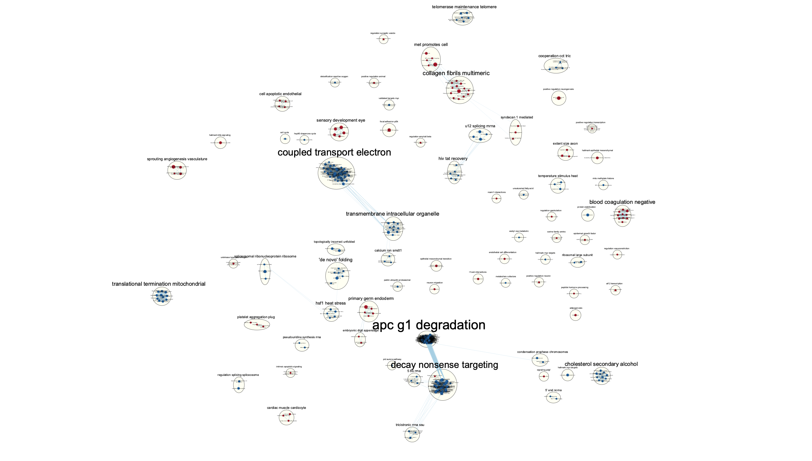
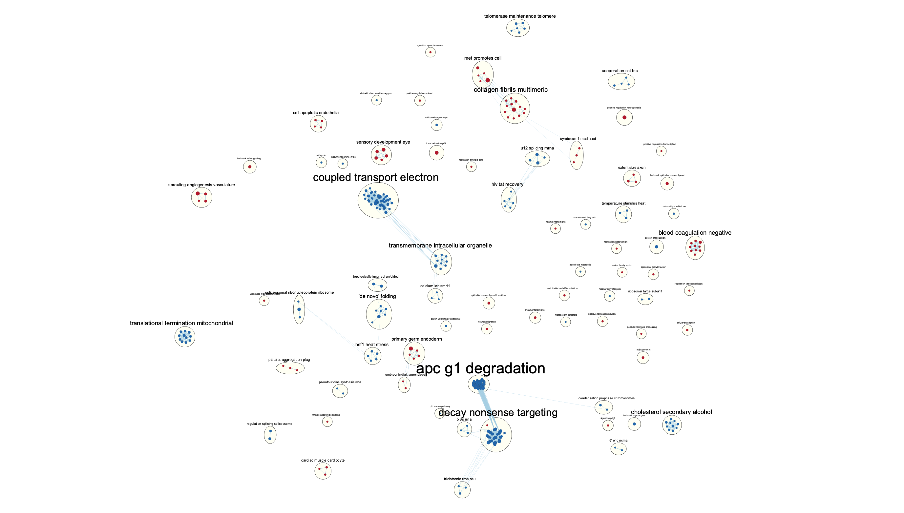
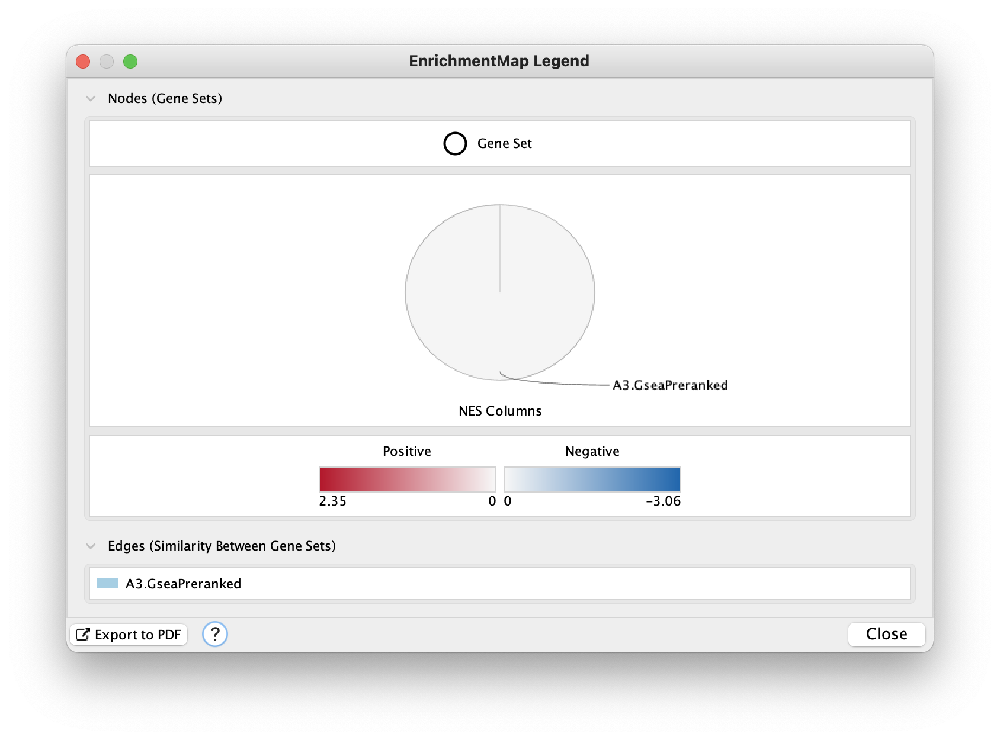
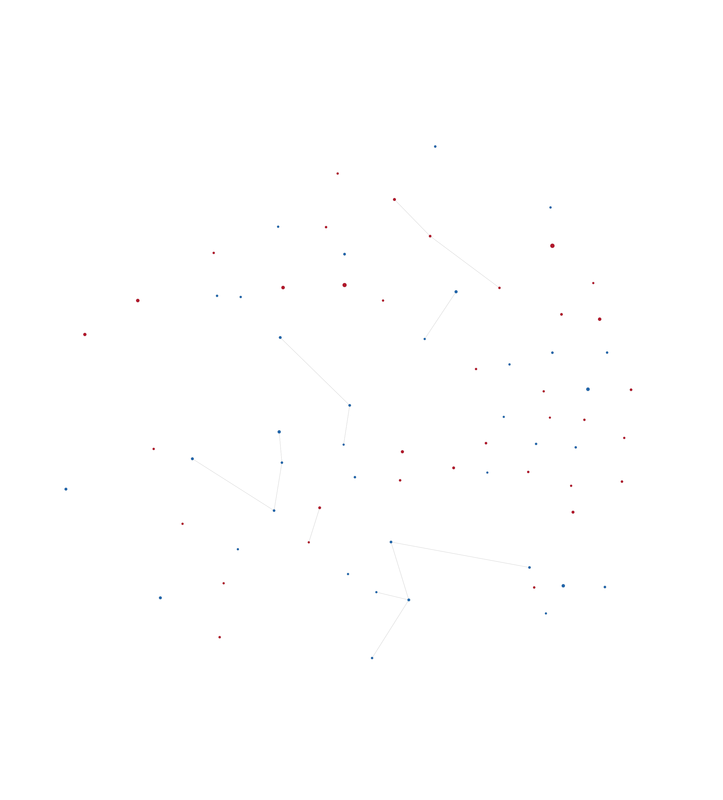
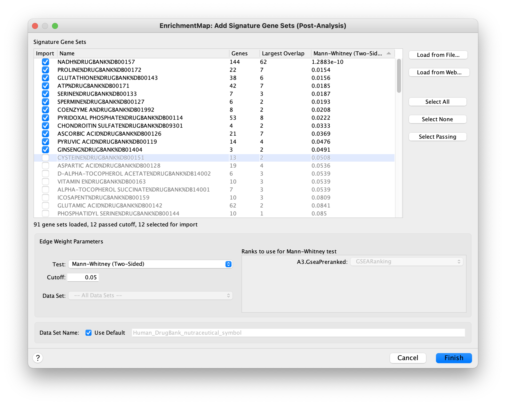
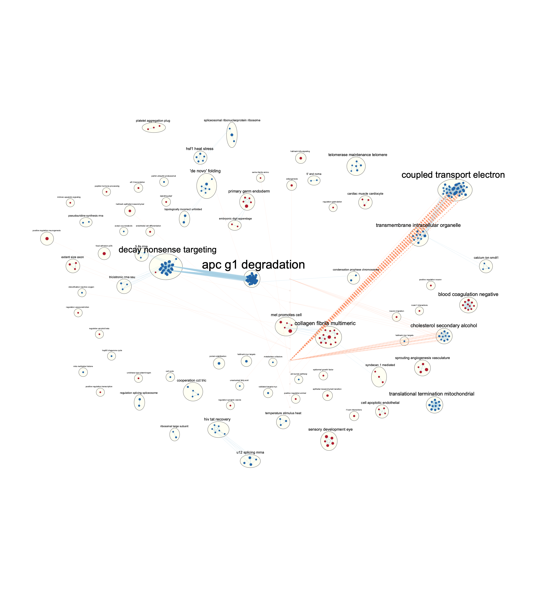

# Before you start
My journal entry of Assignment 3 can be found [here](https://github.com/bcb420-2022/Luomeng_Tan/wiki/9.-Assignment-3---Data-set-Pathway-and-Network-Analysis).


# Brief Introduction
The data is from GSE178521 [@zheng_2022]. This data set have 
6 samples, 3 replicates for the control with GFP knockdown (GFPkd1, GFPkd2, GFPkd3) 
and 3 replicates for the test condition with PRMT5 knockdown (PRMT5kd1, PRMT5kd2, PRMT5kd3). The author aimed to figure out the function of PRMT5 in cancer cells.

I cleaned the data by removing the genes with 0 count for at least 3 samples.
We got 15159 genes left. I did not removed any outliers.

I normalized the data using Trimmed Mean of M-values (TMM) normalization method 
in the edgeR [@robinson_2010] package.

I then performed the differential gene expression analysis with edgeR where the conditions (PRMT5kd or GFPkd) was the only factor that I used in the design. The Benjamni-Hochberg (BH) correction [@benjamini_1995] was used. 

I performed the thresholded over-representation analysis using g:Profiler [@raudvere_2019]. I didn't get the terms such as "negative regulation of T cells" and "type I INFγ response" which was shown to be enriched for the differentially
expressed genes in the PRMT5 knockdown cells (PRMT5kd) [@zheng_2022]. The reason is that the important genes related to these terms, such as Arg2 and CD274, didn't pass the
p-value threshold < 0.05.

# Non-thresholded Gene set Enrichment Analysis

## Prepare the ranked data
To perform GSEA [@subramanian_2005], I needed to create the ranked set of genes. I got the top hits from edgeR differential gene expression analysis, where in total there are 15159 genes. I calculate the rank with the formula -log10(p-value) * sign(logFC).

```{r, message = FALSE, warning = FALSE}
library(knitr)

# load the edgeR result from A2
qlf_output_hits <- readRDS("./A3/qlf_output_hits.rds")

# added rank = -log10(p-value) * sign(logFC) into the dataframe
qlf_output_hits[,"rank"] <- -log(qlf_output_hits$PValue, base = 10) * sign(qlf_output_hits$logFC)
# order in decreasing order of rank
qlf_output_hits <- qlf_output_hits[order(qlf_output_hits$rank, decreasing = TRUE),]

# make the ranked list
ranked_genes <- data.frame(GeneName = rownames(qlf_output_hits), rank = qlf_output_hits[,"rank"])
write.table(ranked_genes, "./A3/all_ranked_genes.rnk", quote = FALSE, row.names = FALSE, sep = "\t")
kable(ranked_genes[c(1:5, 15155:15159),], type="pipe")
```

## GSEA Parameters
I used the [baderlab geneset](http://download.baderlab.org/EM_Genesets/) collection [@merico_2010] from March 1, 2021 containing GO biological process, no IEA and pathways (Human_GOBP_AllPathways_no_GO_iea_March_01_2021_symbol.gmt) as our geneset database.

I ran GSEAPreranked with the following parameters (GSEA v4.2.3):

* Required Fields:
  * Gene set database: baderlab geneset
  * Number of Permutations: 1000 (default)
  * Ranked list: my ranked gene set
  * Collapse/ Remap to gene symbols: No collapse
  * Chip platform: ftp.broadinstitute.org://pub/gsea/annotations_versioned/Human_HGNC_ID_MSigDB.v7.5.1.chip
* Basic Fields:
  * Max size: 200
  * Min size: 15

## GSEA Result
Many top terms for na_pos phenotype (up-regulated genes in PRMT5kd cells) are related to collagen and coagulation and wound healing, which is not seen in thresholded analysis results for up-regulated genes. Whereas in thresholded analysis results, the top terms are related to cell development. Since the paper mentions two terms "negative regulation of T cells" and "type I INFγ response" [@zheng_2022], I specifically looked for those two terms. In the thresholded analysis results, neither of them appears, while both terms appears in the GSEA results even though they are with a poor p-value. In A2, I found that the genes such as such as Arg2 and CD274, didn't pass the p-value threshold < 0.05, so those genes are filtered out in thresholded analysis, that's why the two terms can't be found there. However, here we didn't filter out those genes based on their p-value, so we would get the two terms in the results but not significantly.

NEGATIVE REGULATION OF T CELL ACTIVATION%GOBP%GO:0050868

* ES: 0.47
* NES: 1.31
* p-value: 0.122
* FDR: 0.286

TYPE I INTERFERON SIGNALING PATHWAY%GOBP%GO:0060337

* 0.45	
* 1.29	
* 0.117	
* 0.305

For na_neg phenotype (down-regulated genes in PRMT5kd cells), I saw many terms related to basic biological processes, as seen in the thresholded analysis results.

The comparsion of the threshould analysis and non-thresholded analysis is not that straight forward to me since they used different annotation data source (except GO:BP). However, from the results I can still see that those non-significant genes play some roles on the analysis.

# Visualize the Gene set Enrichment Analysis in Cytoscape
## Enrichment Map
I used Enrichment Map App and set FDR q-value cutoff to 0.01 to visulize the GSEA results.

There are 372 nodes and 6303 edges in the resulting map. The node cutoff is 0.01 and edge cutoff is 0.375.







## Annotate the network
I used the AutoAnnotate App in Cytoscape to add annotation to my results with the following steps:

* Select -> Select all
* Apps -> AutoAnnotate -> New Annotate Set...
* Check "Layout network to prevent overlap"
* Use default setting for other parameters



## Publication ready figure 
I made the publication ready figure by checking the "Publication-Ready" in EnrichmentMap panel.





## Theme Netowrk
I tried to create a theme network by collapsing all clusters in AutoAnnotate, but I could only get the figure below, without any words.

However, I would still looked at Figure 4 to find some major themes. The major themes includes apc g1 degradation, coupled transport electron, and decay nonsense targeting. I can't really fit those themes to the model, and I don't think there are any novel pathway or theme.



# Interpretation
1. Do the enrichment results support conclusions or mechanism discussed in the original paper? How do these results differ from the results you got from Assignment #2 thresholded methods

* The results somehow support the conclusion discussed in the paper since we find the pathways or GO terms that are described in the paper in our GSEA results. However, since those terms and the related genes are not significant, our results doesn't not strongly support or fit their model. Looking at the themes after annotating the network, based on my knowledge I can not easily relate those to the original paper where they showed that "PRMT5 inhibition decreased tumor cell survival" [@zheng_2022].
In the A2 results, even though the genes such as Arg2 and CD274 were filtered out because of poor quality (p-value > 0.05), the ORA results from g:Profiler is more straight forward to me that they attach to the conclusion in the paper.

2. Can you find evidence, i.e. publications, to support some of the results that you see. How does this evidence support your result?

* I can't really find some evidence from the publication to explain the results I got in this assignment. It seems like my analysis is missing some essential features about the dataset. I am not sure which step went wrong, but the important genes indicated in the paper seems to be very poor in quality in my analysis, which makes the results to be a bit hard to relate back to the paper.

# Post Analysis
I added a signature analysis to the network using the nutraceutical drugs from DrugBank. I downloaded the annotation file from [baderlab](http://download.baderlab.org/EM_Genesets/March_01_2021/Human/symbol/DrugTargets/Human_DrugBank_nutraceutical_symbol.gmt) [@merico_2010] from March 1, 2021 collection.

I used the Mann-Whitney (two-sided) test with a cutoff of 0.05.

Below are the terms that overlap:



The nutraceutical gene sets are mainly overlapped with the down-regulated gene sets in our dataset. I searched the NADH in DrugBank and NADH always serves as an electron carrier, which makes sense for the large overlap between the nutraceutical gene sets and the "coupled transport electron" which is down-regulated in the PRMT5kd cells.

There are also papers and clinical trials shows the use of nutraceuticals in the treatment of lung cancers.



# Refernce
